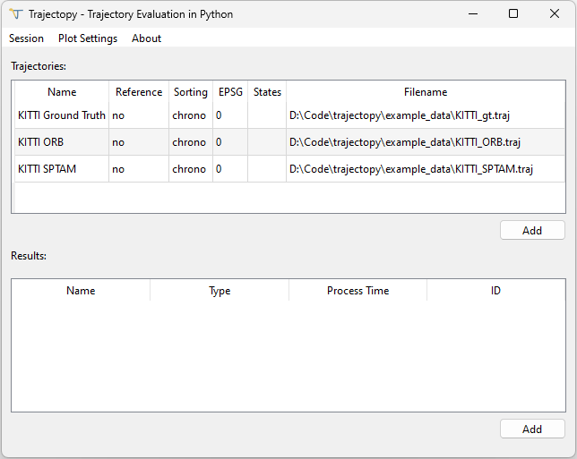
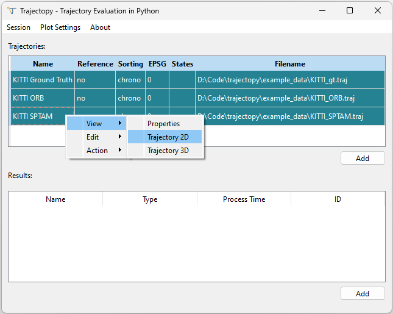
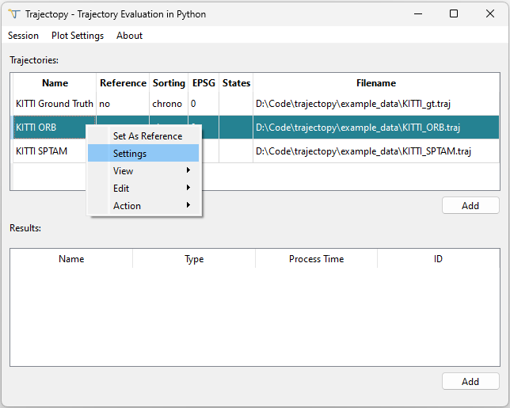
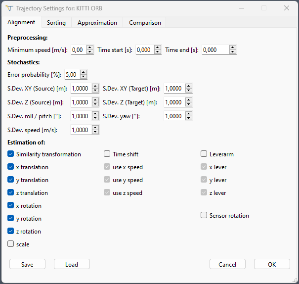
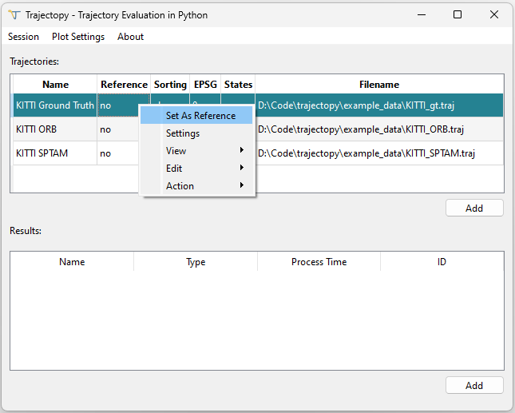
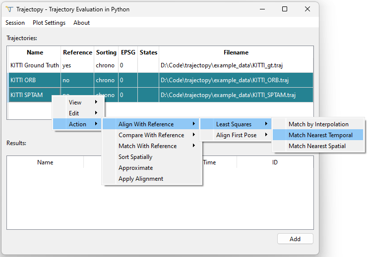
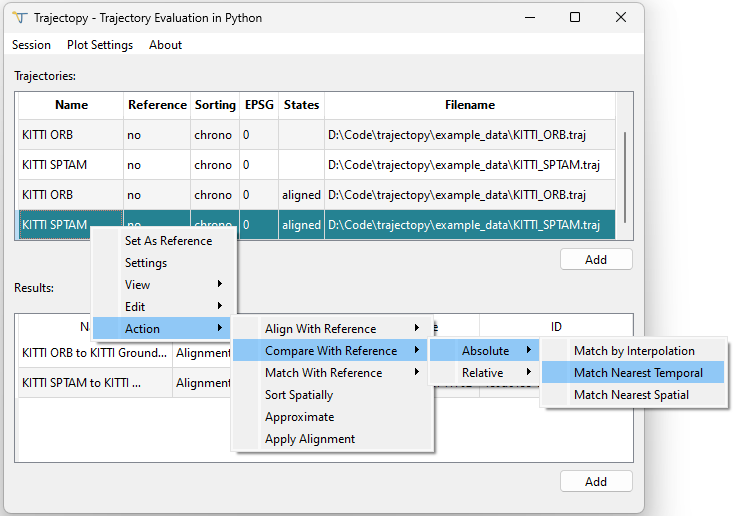
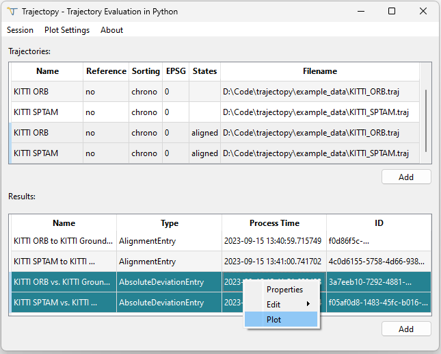
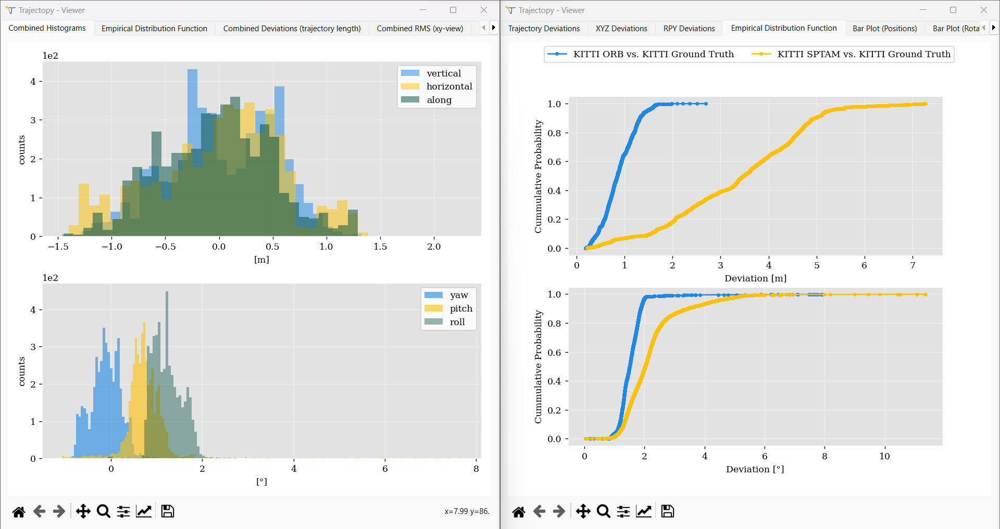

<div align="center">
    <h1>Trajectopy - Trajectory Evaluation in Python</h1>
    <a href="https://github.com/gereon-t/trajectopy/releases"></a>
    <a href="https://www.python.org/downloads/"></a>
    <a href="https://github.com/gereon-t/trajectopy/blob/main/LICENSE"></a>
    <a href="https://github.com/psf/black"></a>
    <br />
    <a href="https://github.com/gereon-t/trajectopy"></a>
    <a href="https://github.com/gereon-t/trajectopy"></a>
    <a href="https://github.com/gereon-t/trajectopy"></a>
    <br />
    <a href="https://www.gug.uni-bonn.de/en/"></a>
    <a href="https://www.gug.uni-bonn.de/en/"></a>

#### Trajectopy is a Python package with an intuitive graphical user interface for empirical trajectory evaluation.

This repository contains the source code of the trajectopy front end PyQt6 GUI. The back-end is part of the trajectopy-core package, see  [https://github.com/gereon-t/trajectopy-core](https://github.com/gereon-t/trajectopy-core).
    

  <p align="center">
    
    
  </p>

</div>


## Key Features

Trajectopy offers a range of features, including:

- Interactive GUI: A user-friendly interface that enables seamless interaction with your trajectory data, making it easy to visualize, align, and compare trajectories.
- Alignment Algorithm: An advanced algorithm that can be tailored to the specific application and supports a similarity transformation, a leverarm and a time shift estimation.
- Comparison Metrics: Absolute and relative comparison metrics that can be computed using various pose-matching methods
- Data Import/Export: Support for importing and exporting data, ensuring compatibility with your existing workflows.
- Customizable Visualization: A flexible visualization that allows users to customize plot styles, tailoring the output to their specific needs.

## Table of Contents
- [Installation](#installation)
- [Exemplary Evaluation](#exemplary-evaluation)
- [Importing Trajectories](#importing-trajectories)
- [Aligning Trajectories](#aligning-trajectories)
- [Comparing Trajectories](#comparing-trajectories)
- [Spatial Sorting](#spatial-sorting-experimental)
- [Approximation](#approximation)
- [Keyboard Shortcuts](#keyboard-shortcuts)
- [Sessions](#sessions)
- [Plotting](#plotting)


## Installation

Since version 1.1.0, trajectopy supports Python 3.8.2

#### Create virtual environment (Optional but recommended)
Unix

```console
python3 -m venv .venv
```

Windows

```console
python -m venv .venv
```

Activate (Unix)

```console
source .venv/bin/activate
```

**or** (Windows)
```console
.\.venv\Scripts\activate
```

#### Installation via pip
Update pip:

```console
pip install --upgrade pip
```

Install trajectopy:

```console
pip install trajectopy
```

Run
  
```console
trajectopy
```

or

```console
python -m trajectopy
```

### Or using the repository:

```console
git clone https://github.com/gereon-t/trajectopy.git
```
```console
cd trajectopy
```

```console
poetry install
```

Run
```console
poetry run trajectopy
```
or 
```console
poetry shell
```
and then
```console
trajectopy
```

## Exemplary Evaluation

The primary function of this program is to align and compare trajectories, which represent the position and orientation of a vehicle over time. To empirically evaluate a trajectory, it can be compared to a ground truth. However, since the two trajectories may not be in the same coordinate system, may differ by a lever arm, or may not be exactly synchronized, they need to be aligned first before the actual comparison. After that, both absolute and relative comparison metrics can be calculated.

When you start the program, you can import trajectories, for example, from the provided [example data folder](https://github.com/gereon-t/trajectopy/tree/main/example_data). This can be done by dragging the file into the trajectory table or clicking the "Add" button below the table.



To visualize the trajectories, you can select them, right-click and choose "Trajectory 2D" from the "View" menu, or simply press V.




To prepare for the comparison, you need to align the estimated trajectories with the ground truth trajectory. To do this, you can access the settings of each trajectory to be aligned by right-clicking on it and selecting "Settings" or by pressing S. 



By default, a rigid-body transformation is configured, assuming observation uncertainties of 1 meter in position and 1 degree in rotation. These default settings are suitable for most quick alignments.



Next, you select the ground truth trajectory as the reference, either through the right-click menu or by pressing R. 



Finally, you can initiate the alignment by selecting one or more trajectories and pressing "Action," then "Align with Reference", "Least Squares" and for example choosing the "Nearest Temporal" option. This first matches both trajectories based on their timestamps and then aligns them using a Least Squares adjustment. Each alignment results in a new trajectory and in a new result. These are the aligned trajectories and the alignment parameters estimated during the process.




Besides "Nearest Temporal" you can also match trajectories using interpolation or nearest-neighbor queries. When aligning trajectories using the interpolation method, positions of the trajectories at non-observed timestamps are interpolated based on the available data points. This can be useful when the timestamps of the two trajectories don't exactly match, and some intermediate positions are required to establish correspondence between them.

On the other hand, the "Nearest-Spatial" method finds the closest data points between the two trajectories based on a distance metric. This approach can be useful when the timestamps of the two trajectories are inaccurate or offset.

To evaluate both aligned trajectories, you can select them and use the "Compare with Reference" option. In this example, we conduct an absolute comparison using timestamp-based matching.



The deviations calculated during the comparison are added to the results table. You can visualize these deviations by right-clicking and selecting the "Plot" option. 



The program supports plotting a single trajectory comparison (left) or multiple comparisons simultaneously (right).




## Importing Trajectories

Trajectories can be imported using the "Add" button below the trajectory table or by dragging files into the area of the trajectory table.
Trajectory files must be ASCII files with a csv-like layout, by default, trajectopy filters for the ".traj" extension. The default column structure that can be read without any configuration is the following:

| time | position x | position y | position z | quaternion x | quaternion y | quaternion z | quaternion w |
|---|---|---|---|---|---|---|---|


Columns are expected to be separated by commas by default.

It is recommended to provide a header at the beginning of the trajectory file. Header entries always begin with a "#".
Below you can find a table of all allowed header entries and their meaning.

| Header | Description  |
|---|---|
| #name | The name provided here is displayed in the table view and in plots of the trajectory |
| #epsg | [EPSG Code](https://epsg.io/) of the datum of the input positions. Required, if geodetic datum transformations are desired. Default: 0, meaning local coordinates without any known geodetic datum |
| #fields | Describes the columns of the ASCII trajectory file. Separated with commas. <table>  <thead>  <th>field name</th>  <th>Meaning</th>  </tr>  </thead>  <tbody>  <tr>  <td>t</td>  <td>time</td>  </tr>  <tr>  <td>l</td>  <td>arc lengths in meters</td>  </tr>  <tr>  <td>px</td>  <td>position x / lat (degrees only)</td>  </tr>  <tr>  <td>py</td>  <td>position y / lon (degrees only) </td>  </tr>  <tr>  <td>pz</td>  <td>position z</td>  </tr> <tr>  <td>qx</td>  <td>quaternion x</td>  </tr> <tr>  <td>qy</td>  <td>quaternion y</td>  </tr> <tr>  <td>qz</td>  <td>quaternion z</td>  </tr> <tr>  <td>qw</td>  <td>quaternion w</td>  </tr> </tr> <tr>  <td>ex</td>  <td>euler angle x</td>  </tr> </tr> <tr>  <td>ey</td>  <td>euler angle y</td>  </tr> </tr> <tr>  <td>ez</td>  <td>euler angle z</td>  </tr> </tr> <tr>  <td>vx</td>  <td>speed x</td>  </tr> </tr> <tr>  <td>vy</td>  <td>speed y</td>  </tr> </tr> <tr>  <td>vz</td>  <td>speed z</td>  </tr> </tr> </tbody>  </table> Example: "#fields t,px,py,pz" Note: The only column that is allowed to appear multiple times is the "t" column. |
| #delimiter | Delimiter used to separate the columns within the file. Default: "," |
| #nframe | Definition of the navigation-frame the orientations of the trajectory refer to. Choices: "enu": East North Up or "ned": North East Down. Default: "enu" |
| #rot_unit | Unit of the orientations. Choices: "deg": Degree, "rad": Radians. Default: "rad" |
| #time_format | Format of the timestamps / dates. Choices: "unix": Unix timestamps (since 01-01-1970), "datetime": Human readable date-times. Default: "unix" |
| #time_offset | Offset in seconds that is applied to the imported timestamps. Default: 0.0 |
| #datetime_format | Format of the datetimes. Only relevant if "time_format" is "datetime". Default: "%Y-%m-%d %H:%M:%S.%f" |
| #datetime_timezone | Time zone of the timestamps. During import, all timestamps are converted to UTC considering the input time zone. Choices: [Time zone](https://en.wikipedia.org/wiki/List_of_tz_database_time_zones) or "GPS" |
| #sorting | Sorting of the input data. Choices: "chrono": Chronologically sorted data (usually the case), "spatial": Spatially sorted data, i.e. along the arc length. Default: "chrono" |
| #state | States describing what processing steps the data already has passed. States: "approximated", "interpolated", "intersected", "aligned", "matched", "sorting_known" |

**New since 0.9.2**: Experimental ROS bag support for geometry_msgs/msg/PoseStamped messages. Files must have a ".bag" extension. Poses must have positions and orientations. One file can contain multiple trajectories published under different topics.

## Aligning Trajectories

The trajectories to be compared could be defined in different coordinate systems and/or refer to different positions on the same platform due to different mounting positions. There may also be a small synchronization offset. To solve this problem, trajectopy provides functionality to align two trajectories using least squares adjustment theory. This allows estimation of up to 11 parameters, all of which can be turned on or off individually to tailor the alignment to the sensor modalities. The alignment settings can be found in the right-click trajectory settings.

### Alignment Settings

| Setting | Description |
|---|---|
| Minimum Speed | If set to a value larger than 0.0, only poses with a speed higher than the specified value are used for alignment. This is only relevant for the time shift estimation where higher speed usually lead to better results. |
| Time Start, Time End | Time range given in seconds relative to the start of the trajectory that should be aligned. If set to non-zero values, only poses in the specified time span are used for alignment. |
| Error Probability | Used for stochastic tests. During the alignment, the functional relationship and the stochastic model are tested for consistency. Besides a global test, there are also tests for each observation group. Observation groups are:  xy_from, z_from, xy_to, z_to, roll_pitch, yaw, speed. |
| Observation Standard Deviations | Standard deviations of the trajectory data involved. |
| Estimation Of | Toggle for individual parameters that should be estimated. Furthermore, the user can specify which components of the 3d speed vector should be used for time shift estimation. |

Parameters that can be estimated:
- Similarity x translation
- Similarity y translation
- Similarity z translation
- Similarity x rotation
- Similarity y rotation
- Similarity z rotation
- Similarity scale
- (small) Time shift
- Lever arm x
- Lever arm y
- Lever arm z
- Sensor rotation (experimental): Use this, if both sensors are mounted on the platform with different orientations

Both trajectories should be roughly synchronized to improve trajectory matching before alignment.

In addition to least squares alignment, you can also perform a basic trajectory alignment by aligning only the first pose.


## Comparing Trajectories

This toolbox allows the comparison of two trajectories using absolute and relative metrics. Before comparison, both trajectories to be compared must be matched. After this, either absolute or relative metrics can be computed. If both trajectory are defined in different coordinate systems, it is recommended to align them accordingly.

### Matching

There are three different types of trajectory matching implemented in trajectopy:
* Matching via interpolation: Poses are matched by interpolating one trajectory onto the timestamps of the other.
* Matching via Nearest Temporal Neighbor: Poses are matched using their timestamps while considering some pre-defined tolerance.
* Matching via Nearest Spatial Neighbor: Poses are matched using their nearest neighbors while considering some pre-defined distance tolerance.

Matching tolerances can be set in the settings of the corresponding trajectory.

### Absolute

This metric is often referred to as Absolute Trajectory Error (ATE). It measures the translational and rotational difference between two matched poses. By default, trajectopy splits the deviations into vertical cross-track, horizontal cross-track, and along-track deviations to simplify interpretation. This behavior can be turned off.

### Relative

For this metric, relative pose-pair differences are compared. The distance between two poses can be specified by the user and can be either time- or distance-based. The comparison involves finding pose pairs separated by a specific distance or time interval, computing the relative translation and rotation between the reference and estimated pose pairs, and calculating the translational and rotational difference normalized by the distance or time that separated the poses.

1. Find pose pair separated by e.g. 100 m in reference trajectory. This pair represents the start and end poses of a sequence of size $N$.
2. Find the corresponding pose pair in estimated trajectory
3. Compute relative translation and rotation between the reference pose pair

    $\Delta_{P~ref} = P_{ref, 1}^{-1} \cdot P_{ref, N}$

4. Compute relative translation and rotation between the estimated pose pair

    $\Delta_{P~est} = P_{est, 1}^{-1} \cdot P_{est, N}$

5. Compute transformation between 3) and 4)

6. Compute translation and rotation error from 5)

7. Divide 6) by the distance or the time that separated both poses (e.g. 100 m).

This metric does not require both trajectories to be aligned. Units are m/m: %, deg/m for distance based comparison and m/s, deg/s for time-based comparison. Pose distances can be set in the settings of the corresponding trajectory:

Example:

- Minimum pose distance: 100
- Maximum pose distance: 800
- Distance step: 100
- Distance unit: Meter

Results in pose distances: [100 m, 200 m, 300 m, 400 m, 500 m, 600 m, 700 m, 800 m]

Furthermore, the user can choose to either use consecutive pose pairs (non-overlapping) or all posible pairs (overlapping).

### Comparison Settings

| Setting | Description |
|---|---|
| Maximum Time Difference (Temporal Matching) [s] | Maximum allowed time difference when matching two trajectories using their timestamps |
| Maximum Distance (Spatial Matching) [m] | During spatial matching, positions are matched using a nearest neighbor approach. This parameter sets the maximum allowed distance between matched positions. |
| Minimum pose distance | Minimum pose pair distance to be considered during RPE computation. Default: 100 |
| Maximum pose distance | Maximum pose pair distance to be considered during RPE computation. Default: 800 |
| Distance step | Step in which the pose distance increases. Default: 100 |
| Distance unit | Unit of the pose distance. Either meter or second. Default: meter |
| Use all pairs | If toggled, overlapping pairs will be used for relative metrics |

## Spatial Sorting (Experimental)

When dealing with repeated trajectories, it may be useful to spatially sort the trajectory for further analysis ([Tombrink et al. 2023](https://www.degruyter.com/document/doi/10.1515/jag-2022-0027/pdf)). This reconstructs the point order as a function of the trajectory length. Trajectopy uses a combination of an iterative voxel-based moving least-squares approximation and a minimum spanning tree to solve this problem.

The point cloud is divided into voxels of a given size. Then, for each point, a number of neighboring voxels are requested. A 3D line is estimated using the points within these voxels. Finally, the current point is projected onto the line to obtain the approximated point. The spatial sorting of this Moving-Least-Squares (MLS) approximation is reconstructed using a minimum spanning tree. Depending on the algorithm, colinear points are discarded in this step.

### Sorting Settings

| Setting | Description |
|---|---|
| Voxel size [m] | Size of the voxel grid used for moving-least-squares approximation |
| k-nearest | Number of voxels used for MLS |
| Movement threshold [m] | MLS will be performed iteratively until the points move less than this specified threshold. |

## Approximation

The trajectory can be approximated using piecewise cubic polynomials for the positions and sliding window based smoothing for the rotations. All observations are assumed to be of equal uncertainty and uncorrelated. The window sizes and the minimum number of observations that should be within an interval can be set by the user.

### Approximation Settings

| Setting | Description |
|---|---|
| Window size (Positions) [m] | The x,y and z- position data is split up into intervals of a size set by this parameter. In each interval, a cubic polynomial approximates the data as best as possible while ensuring C1 continuity.|
| Minimum observation per interval | Minimum number of observations that should be in one interval. Intervals are merged to meet this requirement |
| Rotation Approximation Technique | Either sliding window based approach or (experimental) lap interpolation (only possible for spatially sorted trajectories) |
| Windows size (Rotations) [m] | Sliding window size used for computing the moving-average rotations |

## Keyboard Shortcuts

| Key | Action |
|---|---|
| Ctrl + C | Copy selected entry |
| E | Export selected entry |
| M | Merge selected trajectories |
| P | View properties of selected entry / entries |
| R | Set selected trajectory as reference |
| Shift + R | Unset selected trajectory as reference |
| S | Open trajectory settings |
| T | Transform selected trajectories to a different coordinate system. |
| U | Rename selected entry |
| V | Plot all selected trajectories in 2d |

## Sessions

Sessions allow you to export all imported and computed trajectories and results into a folder. This folder can be imported again after restarting trajectopy, saving time and keeping related data together.

## Plotting

### Custom Matplotlib Style

You can use a custom plotting style by placing a `custom.mplstyle` file in the directory you launched trajectopy in. For instructions on how to define custom plotting styles, please see https://matplotlib.org/stable/tutorials/introductory/customizing.html.
Below you can see the default style of trajectopy
```python
figure.figsize: 8, 6
figure.facecolor: white
font.size: 14
font.family: serif
axes.prop_cycle: cycler("color", ["1E88E5", "#FFC107", "#004D40", "#D81B60", "#2bd2bb", "#a3bbf1", "#3c41fd", "#cc5510", "#3b0732", "#88122b", "#bccb70", "dc9c54"])
axes.facecolor: E2E2E2
axes.edgecolor: white
axes.grid: True
grid.color: white
grid.linewidth: 0.3
axes.grid.which: major
axes.axisbelow: True
legend.facecolor: white
lines.linestyle: -
lines.marker: .
savefig.dpi: 1500
savefig.format: pdf
```

### Plot Settings

| Setting | Description |
|---|---|
| Position Unit | Either meter or millimeter. Affects deviation plots only |
| Stair Histogram | If set to true, deviation histograms are not filled and only a stair is visible. (see also matplotlib documentation) |
| Smoothing Window Width | For better visibility in the deviation plots, the deviations are smoothed with a sliding window of a certain width. Smoothing can be turned off by setting a width of 0.0 or -1.0. The unit is either meters or seconds depending on the sorting of the trajectory.|
| Show Mean Line | Toggles the visibility of a red mean line in deviation plots. |
| Show Directed Deviations (Along / Cross / Vertical)| Absolute position deviations can be separated into along-track, horizontal cross-track and vertical cross-track direction. For this, either the trajectory orientations or positions are used. If turned off, the deviations will be separated into x,y,z which depend on the definition of the world coordinate frame.|
| Grid Megapixels | For every scatter plot, the trajectory data is divided into a grid with a certain number of pixels that can be set with this setting. This prevents slow plotting with large trajectories. |
| RMS Window Width | Similar to the Smoothing Window Width, this parameter sets the width of a sliding window used to smooth the RMS values that are mapped onto the trajectory in scatter plots. Smoothing can be turned off by setting a width of 0.0 or -1.0. The unit is either meters or seconds depending on the sorting of the trajectory.|
| Show Zero-Crossing in Colorbars | Each scatter plot of deviations includes a colorbar, which can be toggled to show the zero-crossing explicitly. |
| Colorbar Step Divisor, Clip Colorbar at X Sigma | The colorbar limits are determined by either the minimum or maximum values, or by the X-sigma range ("Clip-Colorbar at X Sigma" Setting) around the mean deviation, depending on which limit is more restrictive. Starting at the lower bound, the colorbar ticks are placed at positions each separated by the total colorbar range divided by the colorbar step divisor. |
| Do Not Plot Axis | Toggles the visibility of axes in scatter plots |
| Rotate Scatter Plots to Main Axis | When set to true, the scatter plot trajectories will be rotated to align their main axis of extension (determined through principal component analysis) with the x-axis. This can be beneficial for elongated trajectories. |
